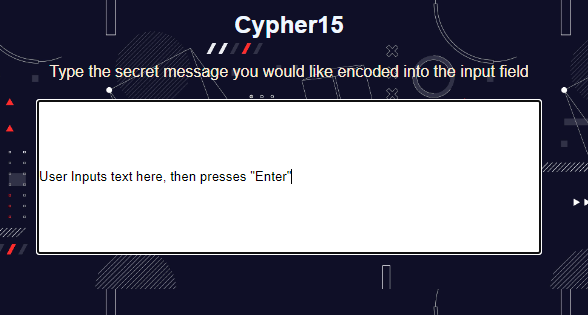

# Cypher15

This is a simple web application that encrypts text using the Caesar Cipher encryption technique. The Caesar Cipher is a substitution cipher where each letter in the plaintext is shifted a certain number of places down or up the alphabet.

## Features

- Encrypt text using the Caesar Cipher technique
- Easy-to-use interface

## How to Use

1. Enter the text you want to encrypt in the input field.

2. Press the "Enter" key.
3. The encrypted text will be displayed in the output area.

## Installation

This application doesn't require any installation. Simply open the `index.html` file in a web browser to use it.

## Technologies Used

- HTML
- CSS
- JavaScript

## Acknowledgements

- The project structure and code are inspired by various online tutorials and resources.

